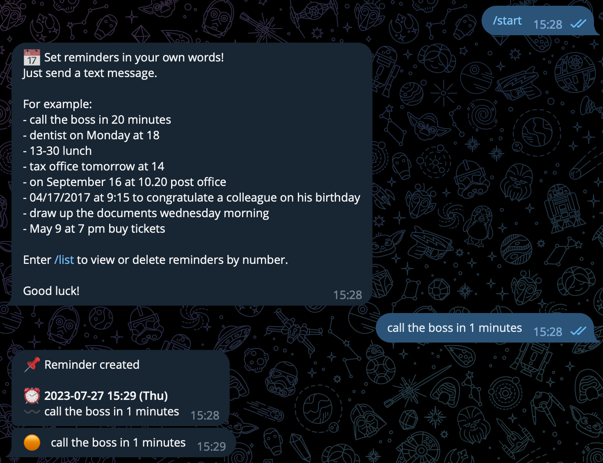
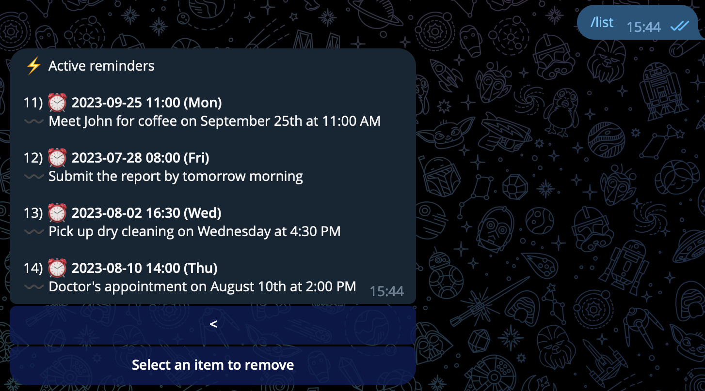

<a name="readme-top"></a>

<div align="center">

<!-- PROJECT LOGO -->
  <a href="https://github.com/DaniilSergeew/reminder-creator-telegram-bot">
    
  </a>

   <p align="center">
      <a href="https://t.me/reminder_creator_bot"><strong>t.me/reminder_creator_bot</strong></a>
   <br />
      Удобный бот для создания напоминаний. Устанавливайте напоминания своими словами! Бот поможет вам не пропустить важные события и встречи.
  </p>

# Reminder creator telegram bot

</div>

<!-- TABLE OF CONTENTS -->
<details>
  <summary>Оглавление</summary>
  <ol>
    <li><a href="#Описание-проекта">Описание проекта</a> </li>
    <li><a href="#Стек">Стек</a></li>
    <li><a href="#Быстрый-старт">Быстрый старт</a></li>
    <li><a href="#Структура-проекта">Структура проекта</a></li>
    <li><a href="#Todo">Todo</a></li>
  </ol>
</details>

## Описание проекта

Функиональность бота:
- Создание напоминаний своими словами
- Просмотр списка активных напоминаний
- Удаление напоминаний по номеру




<p align="right">(<a href="#readme-top">наверх ⬆️</a>)</p>

## Стек

- [![Java][Java]][Java-url]
- [![Spring MVC][Spring MVC]][Spring MVC-url] [![Spring Data][Spring Data]][Spring Data-url]
- [![PostgreSQL][PostgreSQL]][PostgreSQL-url] [![Hibernate][Hibernate]][Hibernate-url]
- [![RabbitMQ][RabbitMQ]][RabbitMQ-url]
- [![Maven][Maven]][Maven-url] [![Lombok][Lombok]][Lombok-url]
- [![Docker][Docker]][Docker-url]
- Для взаимодействия с Telegram API использована библиотека [TelegramBots](https://github.com/rubenlagus/TelegramBots)
- Для обработки естественного языка использована библиотека [prettytime](https://github.com/ocpsoft/prettytime)

<p align="right">(<a href="#readme-top">наверх ⬆️</a>)</p>

## Быстрый старт

1. Установить  [Docker][docker-url] и [Maven][Maven-url]
2. Копировать проект
3. Указать в ```application.properties``` dispatcher сервиса данные бота
4. В директории проекта в консоли выполнить команды:
  ```sh
  mvn clean package 
  docker-compose up
  ```

<p align="right">(<a href="#readme-top">наверх ⬆️</a>)</p>

## Структура проекта

Проект состоит из 4 docker контейнеров:
1. **dispatcher `порт 8084`:**
    - Микросервис взаимоействия с Telegram: регистрация бота, отправка сообщений, а также первичная валидация данных и распределение по очередям в брокере сообщений
2. **reminder-service `порт 8085`:**
    - Микросервис в котором происходит обработка сообщений из брокера и реализована основная бизнес логика приложения
3. **bot-db `порт 5432`:**
   - База данных PostgreSQL, где хранятся все данные.
4. **rabbitmq `порт 5672 и 15672`:**
   - Брокер сообщений RabbitMQ для обмена данными между микросервисами.
<p align="right">(<a href="#readme-top">наверх ⬆️</a>)</p>

## Todo

- [ ] Настроить CI/CD
- [ ] Добавить поддержку часовых поясов
- [ ] Покрыть код тестами
- [ ] Добавить возможность откладывания напоминаний
- [ ] Добавить поддержку голосового ввода
- [ ] Добавить локализации

<p align="right">(<a href="#readme-top">наверх ⬆️</a>)</p>

<!-- MARKDOWN LINKS & IMAGES -->

[Java]: https://img.shields.io/badge/java%2017-orange?style=for-the-badge&logoColor=white
[Java-url]: https://www.java.com/ru/
[Spring MVC]: https://img.shields.io/badge/Spring%20MVC-6DB33F?style=for-the-badge&logo=spring&logoColor=white
[Spring MVC-url]: https://spring.io/projects/spring-boot
[Spring Data]: https://img.shields.io/badge/Spring%20Data-green?style=for-the-badge&logo=spring&logoColor=white
[Spring Data-url]: https://spring.io/projects/spring-data-jpa
[PostgreSQL]: https://img.shields.io/badge/Postgresql-4169E1?style=for-the-badge&logo=postgresql&logoColor=white
[PostgreSQL-url]: https://www.postgresql.org/
[Hibernate]: https://img.shields.io/badge/Hibernate-59666C?style=for-the-badge&logo=hibernate&logoColor=white
[Hibernate-url]: https://hibernate.org/
[RabbitMQ]: https://img.shields.io/badge/Rabbitmq-FF6600?style=for-the-badge&logo=rabbitmq&logoColor=white
[RabbitMQ-url]: https://www.rabbitmq.com/
[Maven]: https://img.shields.io/badge/Maven-C71A36?style=for-the-badge&logo=apachemaven&logoColor=white
[Maven-url]: https://maven.apache.org/
[Lombok]: https://img.shields.io/badge/Lombok-eb839d?style=for-the-badge&logoColor=white
[Lombok-url]: https://projectlombok.org/
[Docker]: https://img.shields.io/badge/Docker-2496ED?style=for-the-badge&logo=docker&logoColor=white
[Docker-url]: https://www.docker.com/

